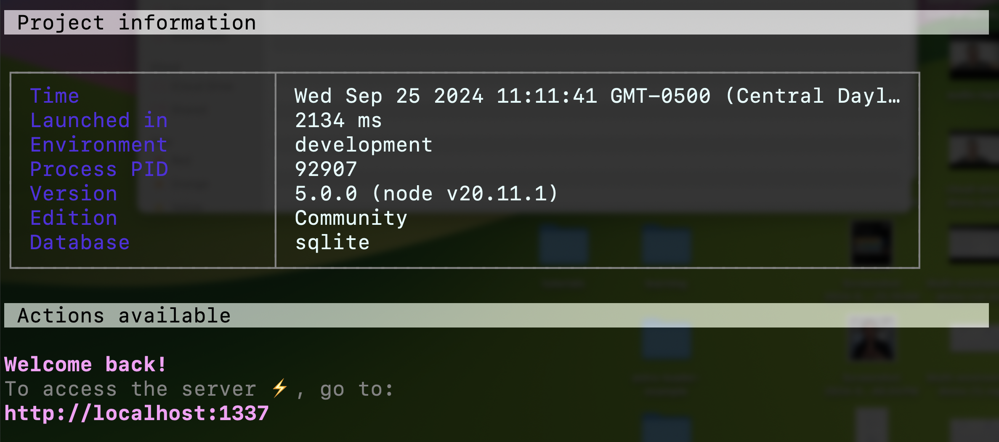
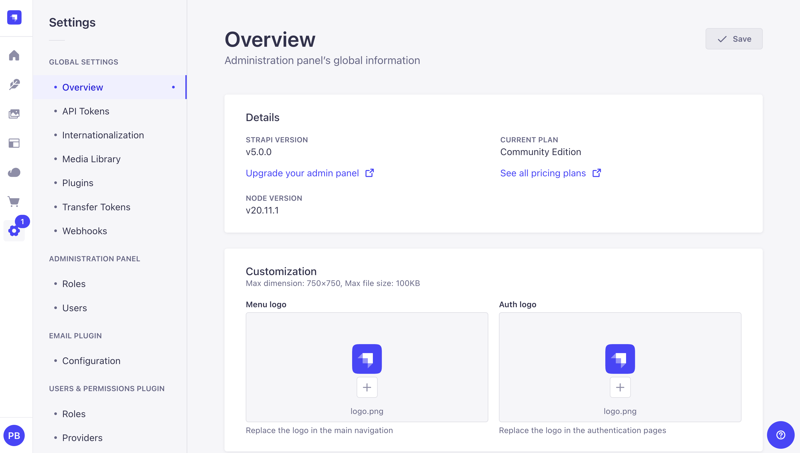
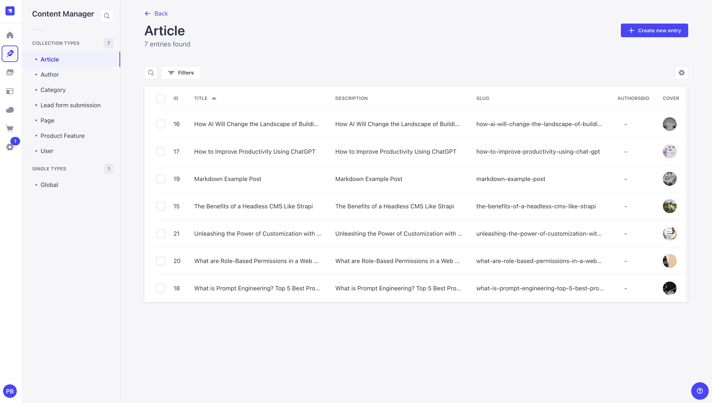
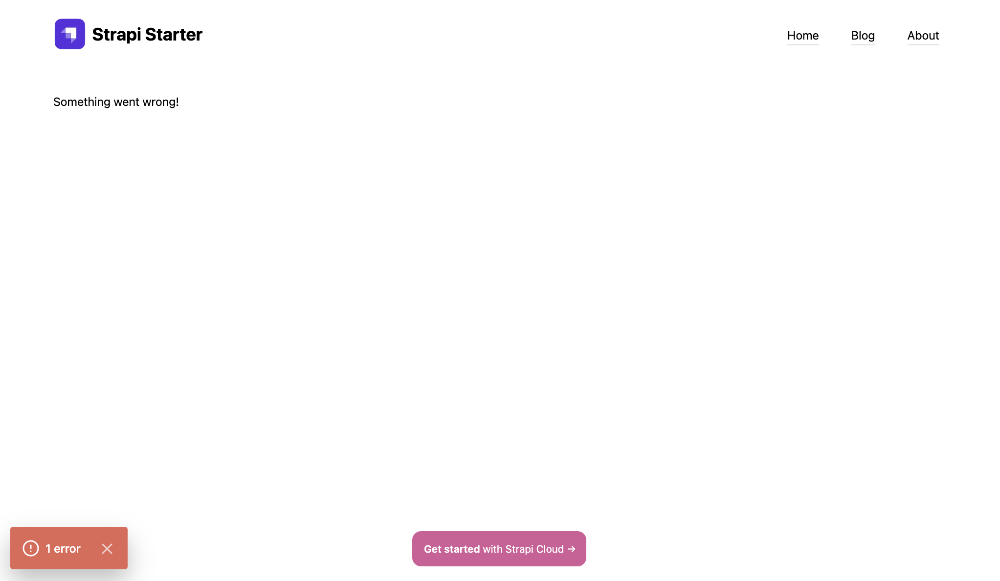
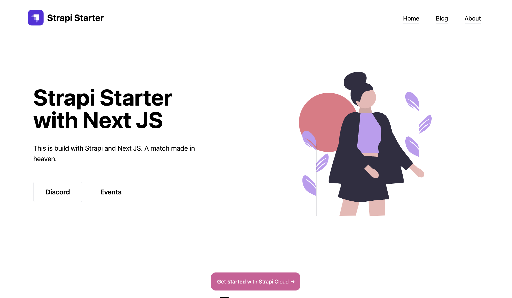
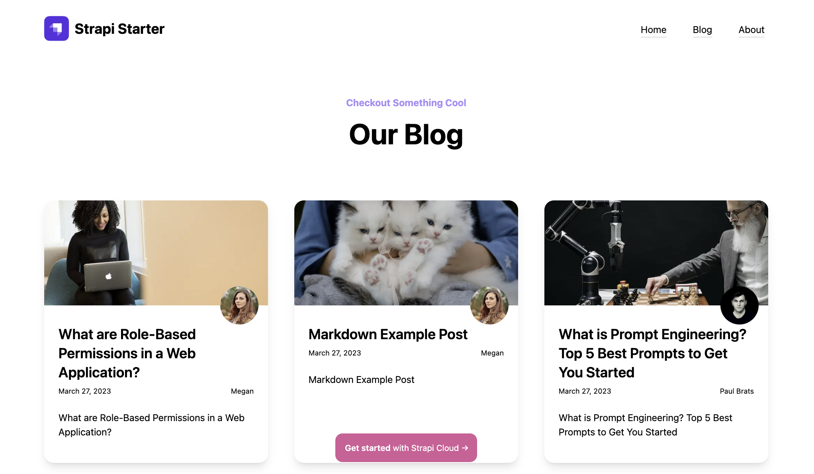
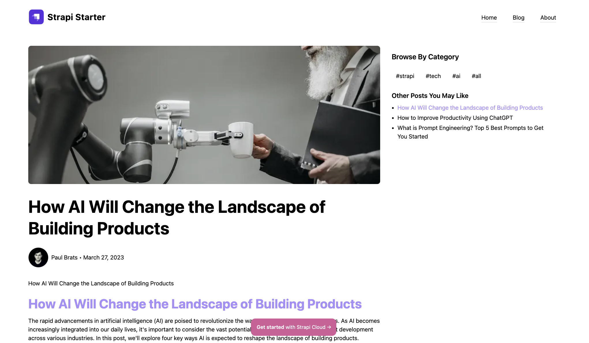

# How To Migrate From Strapi V4 To V5

In this guide, we will walk you through the steps of migrating our corporate starter website from Strapi V4 to V5.

You can learn more about the Strapi v5 upgrade guide [here](https://docs.strapi.io/dev-docs/migration/v4-to-v5/step-by-step).

To help us accomplish this, we will use our codemods update tool that will do majority of the heavy lifting for us.

But before we do that, we need to make sure we have the following:

1. Prepare your project for migration by backing up your code and database.
2. Update your current Strapi version to the latest v4 release.
3. Remove any deprecated plugins that are not yet compatible with Strapi v5.

In my local environment, I have a Strapi v4 project running using sqlite database.

I will start by exporting my data via our DTS export tool so I have a backup of my data.

You can also make a backup of your actual sqlite database file.

If you are using a different database, you will need to make a backup of your database.

In the strapi v4 root directory, I will run the following command to create my backup file:

```bash
yarn strapi export --no-encrypt -f ../backup
```

This will go ahead and export my data.

```bash
$ strapi export --no-encrypt -f ../backup
Starting export...
✔ schemas: 55 transfered (size: 42.1 KB) (elapsed: 4 ms)
✔ entities: 62 transfered (size: 52.6 KB) (elapsed: 16 ms)
✔ assets: 75 transfered (size: 28.7 MB) (elapsed: 655 ms)
✔ links: 78 transfered (size: 14.6 KB) (elapsed: 5 ms)
✔ configuration: 66 transfered (size: 139.7 KB) (elapsed: 2 ms)
┌─────────────────────────────────────────┬───────┬───────────────┐
│ Type                                    │ Count │ Size          │
├─────────────────────────────────────────┼───────┼───────────────┤
│ schemas                                 │    55 │      42.1 KB  │
├─────────────────────────────────────────┼───────┼───────────────┤
│ -- component                            │    33 │ (    13.6 KB) │
├─────────────────────────────────────────┼───────┼───────────────┤
│ -- contentType                          │    22 │ (    28.5 KB) │
├─────────────────────────────────────────┼───────┼───────────────┤
│ entities                                │    62 │      52.6 KB  │
├─────────────────────────────────────────┼───────┼───────────────┤
│ -- api::article.article                 │     7 │ (    21.3 KB) │
├─────────────────────────────────────────┼───────┼───────────────┤
│ -- api::author.author                   │     2 │ (     333 B ) │
├─────────────────────────────────────────┼───────┼───────────────┤
│ -- api::category.category               │     3 │ (     604 B ) │
├─────────────────────────────────────────┼───────┼───────────────┤
│ -- api::global.global                   │     1 │ (     1.4 KB) │
├─────────────────────────────────────────┼───────┼───────────────┤
│ -- api::page.page                       │     2 │ (     3.3 KB) │
├─────────────────────────────────────────┼───────┼───────────────┤
│ -- api::product-feature.product-feature │     5 │ (       1 KB) │
├─────────────────────────────────────────┼───────┼───────────────┤
│ -- plugin::i18n.locale                  │     1 │ (     158 B ) │
├─────────────────────────────────────────┼───────┼───────────────┤
│ -- plugin::upload.file                  │    22 │ (    20.8 KB) │
├─────────────────────────────────────────┼───────┼───────────────┤
│ -- plugin::users-permissions.permission │    16 │ (       3 KB) │
├─────────────────────────────────────────┼───────┼───────────────┤
│ -- plugin::users-permissions.role       │     3 │ (     677 B ) │
├─────────────────────────────────────────┼───────┼───────────────┤
│ assets                                  │    75 │      28.7 MB  │
├─────────────────────────────────────────┼───────┼───────────────┤
│ -- .ico                                 │     1 │ (      15 KB) │
├─────────────────────────────────────────┼───────┼───────────────┤
│ -- .jpg                                 │    52 │ (      23 MB) │
├─────────────────────────────────────────┼───────┼───────────────┤
│ -- .png                                 │    18 │ (     5.7 MB) │
├─────────────────────────────────────────┼───────┼───────────────┤
│ -- .svg                                 │     4 │ (    17.7 KB) │
├─────────────────────────────────────────┼───────┼───────────────┤
│ links                                   │    78 │      14.6 KB  │
├─────────────────────────────────────────┼───────┼───────────────┤
│ configuration                           │    66 │     139.7 KB  │
├─────────────────────────────────────────┼───────┼───────────────┤
│ Total                                   │   336 │        29 MB  │
└─────────────────────────────────────────┴───────┴───────────────┘
Export archive is in ../backup.tar.gz
Export process has been completed successfully!
✨  Done in 2.86s.
```

Now that I have the backup of my data, I can go and remove any deprecated plugins that are not yet compatible with Strapi v5.

In this case, I am using the following plugins:

1. @strapi/plugin-seo

I will go ahead and remove the plugin from the `package.json` file.

And the reference to the plugin in the `config/plugins.ts` file.

Finally, in the `package.json` file, I will update all the references to `4.25.6` to the following `2.25.12`, which was the latest Strapi v4 version when I started this migration.

My updated `package.json` file looks like this:

```json
{
  "name": "corporate-blog-template",
  "private": true,
  "version": "0.1.0",
  "description": "A Strapi application",
  "scripts": {
    "develop": "strapi develop",
    "start": "strapi start",
    "build": "strapi build",
    "strapi": "strapi"
  },
  "devDependencies": {},
  "dependencies": {
    "@strapi/plugin-cloud": "4.25.12",
    "@strapi/plugin-i18n": "4.25.12",
    "@strapi/plugin-users-permissions": "4.25.12",
    "@strapi/strapi": "4.25.12",
    "better-sqlite3": "8.6.0",
    "react": "^18.0.0",
    "react-dom": "^18.0.0",
    "react-router-dom": "5.3.4",
    "styled-components": "5.3.3"
  },
  "author": {
    "name": "A Strapi developer"
  },
  "strapi": {
    "uuid": "0f95dc7c-202b-4ab2-a874-3799d23b1640"
  },
  "engines": {
    "node": ">=18.0.0 <=20.x.x",
    "npm": ">=6.0.0"
  },
  "license": "MIT"
}
```

Now I am going to remove the `yarn.lock` file and the `node_modules` directory.

```bash
rm -rf yarn.lock
rm -rf node_modules
```

And finally run `yarn` command to update our project to the latest Strapi v4 version.

Once your app is updated, run `yarn develop` to make sure everything is working correctly.

Once everything is working correctly, we can go ahead and focus on migrating our **backend\*** first.

But before we do, make sure you commit and save all your changes.

## Using Codemods To Update Strapi V4 To V5

We will start the process by running the following command in the root of our Strapi project:

```bash
  npx @strapi/upgrade major
```

The codemod will show you the changes it will make to your project.

```bash
 backend git:(strapi-5-update-process) npx @strapi/upgrade major
[WARN]  [2024-09-25T16:08:24.314Z] Please make sure you've created a backup of your codebase and files before upgrading
[INFO]  [2024-09-25T16:08:24.977Z] Upgrading from v4.25.12 to v5.0.0
[INFO]  [2024-09-25T16:08:24.979Z] (1/4) Checking requirement...
[INFO]  [2024-09-25T16:08:25.026Z] (2/4) Applying the latest code modifications...
┌────┬─────────┬──────┬────────────────────────────────────────┬──────────┬───────────┬─────────────────────┐
│ N° │ Version │ Kind │ Name                                   │ Affected │ Unchanged │ Duration            │
├────┼─────────┼──────┼────────────────────────────────────────┼──────────┼───────────┼─────────────────────┤
│ 0  │ 5.0.0   │ code │ comment out lifecycle files            │ 0        │ 31        │ 0.440s (cold start) │
│ 1  │ 5.0.0   │ json │ dependency remove strapi plugin i18n   │ 1        │ 40        │ 0.358s              │
│ 2  │ 5.0.0   │ json │ dependency upgrade react and react dom │ 0        │ 41        │ 0.037s              │
│ 3  │ 5.0.0   │ json │ dependency upgrade react router dom    │ 1        │ 40        │ 0.019s              │
│ 4  │ 5.0.0   │ json │ dependency upgrade styled components   │ 1        │ 40        │ 0.019s              │
│ 5  │ 5.0.0   │ code │ deprecate helper plugin                │ 0        │ 31        │ 0.174s              │
│ 6  │ 5.0.0   │ code │ entity service document service        │ 0        │ 31        │ 0.041s              │
│ 7  │ 5.0.0   │ code │ s3 keys wrapped in credentials         │ 0        │ 31        │ 0.018s              │
│ 8  │ 5.0.0   │ json │ sqlite3 to better sqlite3              │ 0        │ 41        │ 0.008s              │
│ 9  │ 5.0.0   │ code │ strapi public interface                │ 0        │ 31        │ 0.027s              │
│ 10 │ 5.0.0   │ code │ use uid for config namespace           │ 0        │ 31        │ 0.034s              │
│ 11 │ 5.0.0   │ code │ utils public interface                 │ 0        │ 31        │ 0.072s              │
└────┴─────────┴──────┴────────────────────────────────────────┴──────────┴───────────┴─────────────────────┘
[INFO]  [2024-09-25T16:08:26.325Z] (3/4) Upgrading Strapi dependencies...
[INFO]  [2024-09-25T16:08:26.326Z] (4/4) Installing dependencies...

```

Depending if you have any custom code, if the codemod is not able to update your code, it will add `__TODO__` comments in the code that you will need to update manually.

In our case, it was pretty straightforward.

Once the codemod is done, and all the new dependencies are installed, we can go ahead and start our project.

```bash
yarn develop
```

You will see the following output in the console:



Now open your browser and navigate to `http://localhost:1337/admin` and login to your admin panel.

You can go to the **Settings** tab and confirm that you are running Strapi v5.



And finally, we can go ahead and take a look at our **Content Manager** page and click on the **Articles** type and see that our articles are still there.



Nice!

Now before we go ahead and focus on migrating our **frontend**, I want to make sure that our **backend** is working correctly.

Let's make a post request to get the data to our **Home Page** and see if we get the correct response.

We will make a get request to the following endpoint:

```
http://localhost:1337/api/pages?filters[slug][$eq]=home
```

We are filtering by the slug `home` because we only want to get the data for our home page with that slug.

But we will get the following error.

```bash
page-populate-middleware.js: ctx.query =  {
  populate: {
    contentSections: { populate: [Object] },
    seo: { fields: [Array], populate: [Object] }
  },
  filters: { slug: { '$eq': 'home' } }
}
[2024-09-25 11:25:02.906] error: Invalid nested populate for page.contentSections (api::page.page). Expected a fragment ("on")
```

In our project I am using a custom middleware to populate the data in the backend.

And the query that we used is using Strapi v4 syntax.

If we navigate to `src/page/middlewares/page-populate-middleware.js` file in our Strapi project, we can see that the query is using the following syntax:

```js
const populate = {
  contentSections: {
    populate: {
      picture: {
        fields: ["url", "alternativeText", "caption", "width", "height"],
      },
      buttons: {
        populate: true,
      },
      feature: {
        populate: {
          fields: ["title", "description", "showLink", "newTab", "url", "text"],
          media: {
            fields: ["url", "alternativeText", "caption", "width", "height"],
          },
        },
      },
      testimonials: {
        populate: {
          picture: {
            fields: ["url", "alternativeText", "caption", "width", "height"],
          },
        },
      },
      plans: {
        populate: ["product_features"],
      },
      submitButton: {
        populate: true,
      },
    },
  },
  seo: {
    fields: ["metaTitle", "metaDescription"],
    populate: { shareImage: true },
  },
};
```

We need to update it to use the `on` flag to populate our dynamic zone fields.

You can learn more about this in our documentation [here](https://docs.strapi.io/dev-docs/api/document-service/populate#components--dynamic-zones).

So let's go ahead and update the query to use Strapi v5 syntax with the following code:

```js
const populate = {
  contentSections: {
    on: {
      "sections.hero": {
        populate: "*",
      },
      "sections.features": {
        populate: "*",
      },
      "sections.bottom-actions": {
        populate: "*",
      },
      "sections.feature-columns-group": {
        populate: "*",
      },
      "sections.feature-rows-group": {
        populate: "*",
      },
      "sections.testimonials-group": {
        populate: {
          testimonials: {
            populate: "*",
          },
        },
      },
      "sections.large-video": {
        populate: "*",
      },
      "sections.rich-text": {
        populate: "*",
      },
      "sections.pricing": {
        populate: {
          plans: {
            populate: "*",
          },
        },
      },
      "sections.lead-form": {
        populate: "*",
      },
      "sections.heading": {
        populate: "*",
      },
    },
  },
  seo: {
    populate: "*",
  },
};
```

You can see that we are using the `on` flag to populate our dynamic zone fields.

I am using the `*` to populate all the fields for each section that will populate one level deep.

But you can learn more about the `on` flag [here](https://docs.strapi.io/dev-docs/api/document-service/populate#components--dynamic-zones).

We should get a successful response with the following data:

```json
{
  "data": [
    {
      "id": 7,
      "shortName": "Home Page",
      "slug": "home",
      "heading": "Home Page",
      "description": "This is the home page",
      "createdAt": "2023-03-08T14:13:57.041Z",
      "updatedAt": "2024-09-25T16:22:15.255Z",
      "publishedAt": "2024-09-25T16:22:15.278Z",
      "locale": "en",
      "documentId": "jp9xgszv0fiebxygaonae4jr",
      "contentSections": [
        {
          "__component": "sections.hero",
          "id": 5,
          "title": "Strapi [Starter] with Next JS",
          "description": "This is build with [Strapi] and [Next] JS. A match made in heaven.",
          "picture": {
            "id": 11,
            "name": "undraw_woman_ffrd.svg",
            "alternativeText": null,
            "caption": null,
            "width": 643,
            "height": 700,
            "formats": null,
            "hash": "undraw_woman_ffrd_b3ac24fb06",
            "ext": ".svg",
            "mime": "image/svg+xml",
            "size": 6.76,
            "url": "/uploads/undraw_woman_ffrd_b3ac24fb06.svg",
            "previewUrl": null,
            "provider": "local",
            "provider_metadata": null,
            "createdAt": "2023-03-09T18:10:31.642Z",
            "updatedAt": "2024-09-25T15:45:42.919Z",
            "documentId": "lojbt8nq3a7lbs1ket3s4ye2",
            "locale": null,
            "publishedAt": null
          },
          "buttons": [
            {
              "id": 6,
              "url": "https://discord.com/invite/strapi",
              "newTab": true,
              "text": "Discord",
              "type": "secondary"
            },
            {
              "id": 7,
              "url": "https://strapi.io/events",
              "newTab": true,
              "text": "Events",
              "type": "primary"
            }
          ]
        },
        {
          "__component": "sections.features",
          "id": 3,
          "heading": "Features",
          "description": "Welcome to Strapi Starter",
          "feature": [
            {
              "id": 7,
              "title": "Discover Next.js",
              "description": "The React Framework for Production: Explore the future of web development with Next.js, the cutting-edge React framework.",
              "showLink": true,
              "newTab": true,
              "url": "https://vercel.com/",
              "text": "Learn more"
            },
            {
              "id": 8,
              "title": "Strapi",
              "description": "Unleash the power of Strapi, the leading open-source headless CMS that lets you create, manage, and distribute your content across multiple platforms.",
              "showLink": true,
              "newTab": true,
              "url": "https://strapi.io",
              "text": "Learn more"
            },
            {
              "id": 9,
              "title": "Cloud",
              "description": "Simplify your content management experience with Strapi Cloud, the fully-managed hosting solution for your Strapi projects.",
              "showLink": true,
              "newTab": true,
              "url": "https://strapi.io/cloud",
              "text": "Learn more"
            }
          ]
        },
        {
          "__component": "sections.pricing",
          "id": 3,
          "title": "Our Plans",
          "plans": [
            {
              "id": 7,
              "name": "Free",
              "description": "Features",
              "isRecommended": false,
              "price": 0,
              "pricePeriod": "Monthly",
              "product_features": [
                {
                  "id": 1,
                  "name": "Example Feature 1",
                  "createdAt": "2023-03-10T15:45:14.988Z",
                  "updatedAt": "2023-03-28T15:45:07.118Z",
                  "publishedAt": "2023-03-10T15:45:16.468Z",
                  "documentId": "ji45ovqy68cpuj9a8hgfb67v",
                  "locale": null
                },
                {
                  "id": 3,
                  "name": "Example Feature 2",
                  "createdAt": "2023-03-10T15:46:27.207Z",
                  "updatedAt": "2023-03-28T15:45:18.540Z",
                  "publishedAt": "2023-03-10T15:46:27.565Z",
                  "documentId": "wxim98n316kfqy54zsmdazkp",
                  "locale": null
                },
                {
                  "id": 4,
                  "name": "Example Feature 3",
                  "createdAt": "2023-03-10T15:46:39.431Z",
                  "updatedAt": "2023-03-28T15:45:28.608Z",
                  "publishedAt": "2023-03-10T15:46:40.548Z",
                  "documentId": "v6phofjnzfn0q2i9ham968mj",
                  "locale": null
                }
              ]
            },
            {
              "id": 8,
              "name": "Pro",
              "description": "Features",
              "isRecommended": true,
              "price": 9.99,
              "pricePeriod": "monthly",
              "product_features": [
                {
                  "id": 1,
                  "name": "Example Feature 1",
                  "createdAt": "2023-03-10T15:45:14.988Z",
                  "updatedAt": "2023-03-28T15:45:07.118Z",
                  "publishedAt": "2023-03-10T15:45:16.468Z",
                  "documentId": "ji45ovqy68cpuj9a8hgfb67v",
                  "locale": null
                },
                {
                  "id": 3,
                  "name": "Example Feature 2",
                  "createdAt": "2023-03-10T15:46:27.207Z",
                  "updatedAt": "2023-03-28T15:45:18.540Z",
                  "publishedAt": "2023-03-10T15:46:27.565Z",
                  "documentId": "wxim98n316kfqy54zsmdazkp",
                  "locale": null
                },
                {
                  "id": 4,
                  "name": "Example Feature 3",
                  "createdAt": "2023-03-10T15:46:39.431Z",
                  "updatedAt": "2023-03-28T15:45:28.608Z",
                  "publishedAt": "2023-03-10T15:46:40.548Z",
                  "documentId": "v6phofjnzfn0q2i9ham968mj",
                  "locale": null
                },
                {
                  "id": 2,
                  "name": "Example Feature 4",
                  "createdAt": "2023-03-10T15:45:47.489Z",
                  "updatedAt": "2023-03-28T15:46:00.360Z",
                  "publishedAt": "2023-03-10T15:46:10.561Z",
                  "documentId": "jykjv5t5h5kqh2u649un53ss",
                  "locale": null
                }
              ]
            },
            {
              "id": 9,
              "name": "Enterprise ",
              "description": "Features",
              "isRecommended": false,
              "price": 19.99,
              "pricePeriod": "monthly",
              "product_features": [
                {
                  "id": 1,
                  "name": "Example Feature 1",
                  "createdAt": "2023-03-10T15:45:14.988Z",
                  "updatedAt": "2023-03-28T15:45:07.118Z",
                  "publishedAt": "2023-03-10T15:45:16.468Z",
                  "documentId": "ji45ovqy68cpuj9a8hgfb67v",
                  "locale": null
                },
                {
                  "id": 3,
                  "name": "Example Feature 2",
                  "createdAt": "2023-03-10T15:46:27.207Z",
                  "updatedAt": "2023-03-28T15:45:18.540Z",
                  "publishedAt": "2023-03-10T15:46:27.565Z",
                  "documentId": "wxim98n316kfqy54zsmdazkp",
                  "locale": null
                },
                {
                  "id": 4,
                  "name": "Example Feature 3",
                  "createdAt": "2023-03-10T15:46:39.431Z",
                  "updatedAt": "2023-03-28T15:45:28.608Z",
                  "publishedAt": "2023-03-10T15:46:40.548Z",
                  "documentId": "v6phofjnzfn0q2i9ham968mj",
                  "locale": null
                },
                {
                  "id": 2,
                  "name": "Example Feature 4",
                  "createdAt": "2023-03-10T15:45:47.489Z",
                  "updatedAt": "2023-03-28T15:46:00.360Z",
                  "publishedAt": "2023-03-10T15:46:10.561Z",
                  "documentId": "jykjv5t5h5kqh2u649un53ss",
                  "locale": null
                },
                {
                  "id": 5,
                  "name": "Example Feature 5",
                  "createdAt": "2023-03-28T15:45:55.243Z",
                  "updatedAt": "2023-03-28T15:50:01.464Z",
                  "publishedAt": "2023-03-28T15:50:01.464Z",
                  "documentId": "vjmgoy0s7xvdgn1hlyk3wxhz",
                  "locale": null
                }
              ]
            }
          ]
        },
        {
          "__component": "sections.testimonials-group",
          "id": 3,
          "title": "Testimonials",
          "description": "Hello",
          "testimonials": [
            {
              "id": 5,
              "text": "ed ut perspiciatis unde omnis iste natus error sit voluptatem accusantium doloremque laudantium, totam rem aperiam, eaque ipsa quae ab illo inventore veritatis et quasi architecto beatae vitae dicta sunt explicabo.",
              "authorName": "Paul Brats",
              "picture": {
                "id": 20,
                "name": "paul-brats.jpg",
                "alternativeText": null,
                "caption": null,
                "width": 200,
                "height": 200,
                "formats": {
                  "thumbnail": {
                    "name": "thumbnail_paul-brats.jpg",
                    "hash": "thumbnail_paul_brats_012832af74",
                    "ext": ".jpg",
                    "mime": "image/jpeg",
                    "path": null,
                    "width": 156,
                    "height": 156,
                    "size": 2.56,
                    "url": "/uploads/thumbnail_paul_brats_012832af74.jpg"
                  }
                },
                "hash": "paul_brats_012832af74",
                "ext": ".jpg",
                "mime": "image/jpeg",
                "size": 3.66,
                "url": "/uploads/paul_brats_012832af74.jpg",
                "previewUrl": null,
                "provider": "local",
                "provider_metadata": null,
                "createdAt": "2023-03-28T19:11:03.636Z",
                "updatedAt": "2024-09-25T15:45:45.087Z",
                "documentId": "pc0wncap7g6411vuk9y7ke6q",
                "locale": null,
                "publishedAt": null
              }
            },
            {
              "id": 6,
              "text": "ed ut perspiciatis unde omnis iste natus error sit voluptatem accusantium doloremque laudantium, totam rem aperiam, eaque ipsa quae ab illo inventore veritatis et quasi architecto beatae vitae dicta sunt explicabo.",
              "authorName": "Kit Kat",
              "picture": {
                "id": 22,
                "name": "kit-kat.png",
                "alternativeText": null,
                "caption": null,
                "width": 2000,
                "height": 2000,
                "formats": {
                  "thumbnail": {
                    "name": "thumbnail_kit-kat.png",
                    "hash": "thumbnail_kit_kat_96feba6636",
                    "ext": ".png",
                    "mime": "image/png",
                    "path": null,
                    "width": 156,
                    "height": 156,
                    "size": 67.8,
                    "url": "/uploads/thumbnail_kit_kat_96feba6636.png"
                  },
                  "small": {
                    "name": "small_kit-kat.png",
                    "hash": "small_kit_kat_96feba6636",
                    "ext": ".png",
                    "mime": "image/png",
                    "path": null,
                    "width": 500,
                    "height": 500,
                    "size": 600.17,
                    "url": "/uploads/small_kit_kat_96feba6636.png"
                  },
                  "medium": {
                    "name": "medium_kit-kat.png",
                    "hash": "medium_kit_kat_96feba6636",
                    "ext": ".png",
                    "mime": "image/png",
                    "path": null,
                    "width": 750,
                    "height": 750,
                    "size": 1284.78,
                    "url": "/uploads/medium_kit_kat_96feba6636.png"
                  },
                  "large": {
                    "name": "large_kit-kat.png",
                    "hash": "large_kit_kat_96feba6636",
                    "ext": ".png",
                    "mime": "image/png",
                    "path": null,
                    "width": 1000,
                    "height": 1000,
                    "size": 2210.36,
                    "url": "/uploads/large_kit_kat_96feba6636.png"
                  }
                },
                "hash": "kit_kat_96feba6636",
                "ext": ".png",
                "mime": "image/png",
                "size": 1565.85,
                "url": "/uploads/kit_kat_96feba6636.png",
                "previewUrl": null,
                "provider": "local",
                "provider_metadata": null,
                "createdAt": "2024-05-31T16:19:28.746Z",
                "updatedAt": "2024-09-25T15:45:45.803Z",
                "documentId": "dx3tr3h6uhzu62it0wl4sskv",
                "locale": null,
                "publishedAt": null
              }
            }
          ]
        },
        {
          "__component": "sections.lead-form",
          "id": 3,
          "title": "Join our community.",
          "emailPlaceholder": "Enter your email",
          "location": "main page",
          "description": "Doloribus consectetur quasi ipsa quo neque culpa blanditiis ducimus recusandae a veritatis optio cumque, in harum ad nam!",
          "submitButton": {
            "id": 3,
            "text": "Submit",
            "type": "primary"
          }
        }
      ],
      "seo": {
        "id": 19,
        "metaTitle": "Home Page",
        "metaDescription": "This is the home page",
        "shareImage": {
          "id": 19,
          "name": "ai-prompt.jpg",
          "alternativeText": null,
          "caption": null,
          "width": 5192,
          "height": 3466,
          "formats": {
            "thumbnail": {
              "name": "thumbnail_ai-prompt.jpg",
              "hash": "thumbnail_ai_prompt_e43fe026b1",
              "ext": ".jpg",
              "mime": "image/jpeg",
              "path": null,
              "width": 234,
              "height": 156,
              "size": 8.15,
              "url": "/uploads/thumbnail_ai_prompt_e43fe026b1.jpg"
            },
            "small": {
              "name": "small_ai-prompt.jpg",
              "hash": "small_ai_prompt_e43fe026b1",
              "ext": ".jpg",
              "mime": "image/jpeg",
              "path": null,
              "width": 500,
              "height": 334,
              "size": 24.77,
              "url": "/uploads/small_ai_prompt_e43fe026b1.jpg"
            },
            "medium": {
              "name": "medium_ai-prompt.jpg",
              "hash": "medium_ai_prompt_e43fe026b1",
              "ext": ".jpg",
              "mime": "image/jpeg",
              "path": null,
              "width": 750,
              "height": 500,
              "size": 47.18,
              "url": "/uploads/medium_ai_prompt_e43fe026b1.jpg"
            },
            "large": {
              "name": "large_ai-prompt.jpg",
              "hash": "large_ai_prompt_e43fe026b1",
              "ext": ".jpg",
              "mime": "image/jpeg",
              "path": null,
              "width": 1000,
              "height": 667,
              "size": 73.64,
              "url": "/uploads/large_ai_prompt_e43fe026b1.jpg"
            }
          },
          "hash": "ai_prompt_e43fe026b1",
          "ext": ".jpg",
          "mime": "image/jpeg",
          "size": 2395.35,
          "url": "/uploads/ai_prompt_e43fe026b1.jpg",
          "previewUrl": null,
          "provider": "local",
          "provider_metadata": null,
          "createdAt": "2023-03-28T17:06:52.873Z",
          "updatedAt": "2024-09-25T15:45:44.952Z",
          "documentId": "uucl140hzuga3r5tmgiow2db",
          "locale": null,
          "publishedAt": null
        }
      }
    }
  ],
  "meta": {
    "pagination": {
      "page": 1,
      "pageSize": 25,
      "pageCount": 1,
      "total": 1
    }
  }
}
```

Nice! Now that we have our data from our API, we can go ahead and start migrating our frontend.

## Updating Our Frontend To Work With Strapi V5

So let's start by starting our frontend project and seeing what error we will get.

Navigate to your next.js project and run the following command to start your frontend:

```bash
yarn dev
```

And you will probably see an error, a blank screen, or both.

This is a good reminder, when migrating, this is a good time to think of possible refactors.

As we continue on this journey to migrate our frontend to strapi v5, we can start by updating our `utils/fetch-api.ts` file.

We will need to update the `fetchAPI` function to the following:

```ts
import qs from "qs";
import { getStrapiURL } from "./api-helpers";

export async function fetchAPI(path: string, query: any, authToken?: string) {
  const baseURL = getStrapiURL();
  const url = new URL("/api" + path, baseURL);
  url.search = qs.stringify(query);

  const baseHeader = {
    method: "GET",
    headers: {
      "Content-Type": "application/json",
      "Strapi-Response-Format": "v4",
    },
  };

  const headerWithAuth = {
    ...baseHeader,
    headers: {
      ...baseHeader.headers,
      Authorization: `Bearer ${authToken}`,
    },
  };

  try {
    const response = await fetch(url, authToken ? headerWithAuth : baseHeader);
    const data = await response.json();
    if (!response.ok) throw new Error("Failed to fetch data");
    return data;
  } catch (error) {
    console.error("Error fetching data:", error);
    throw error;
  }
}
```

Notice that we are using the `Strapi-Response-Format` header to tell Strapi to respond in `v4` format.

This will allow us to get the old data format. That we can use to test our frontend before we update it to the new format.

Since we added some changes in this file, for instance, instead of using `options` we are now using `authToken`.

We will need to update this whereever we are using the `fetchAPI` function.

Les's start in the our root `layout.tsx` file.

We will update the `getGlobal` function to the following:

```ts
async function getGlobal(lang: string): Promise<any> {
  const token = process.env.NEXT_PUBLIC_STRAPI_API_TOKEN;

  if (!token)
    throw new Error("The Strapi API Token environment variable is not set.");

  const path = `/global`;

  const urlParamsObject = {
    populate: [
      "metadata",
      "favicon",
      "notificationBanner.link",
      "navbar.links",
      "navbar.navbarLogo.logoImg",
      "footer.footerLogo.logoImg",
      "footer.menuLinks",
      "footer.legalLinks",
      "footer.socialLinks",
      "footer.categories",
    ],
    locale: lang,
  };
  return await fetchAPI(path, urlParamsObject, token);
}
```

The two changes we made are:

1. We removed `metadata.sharedImage` since this was removed when we removed the Strapi SEO plugin earlier.

2. We removed the `options` params since we are now setting it inside `fethAPI` directly.
3. And finally we passed down our token to the `fetchAPI` function.

Nice! With all these changes, we should be able to get our global data.

Which should display out **Top Navigation** and **Footer** on our page.



Now let's navigate to our `utils/get-page-by-slug.ts` file and make the following changes:

```ts
import { fetchAPI } from "@/app/[lang]/utils/fetch-api";

export async function getPageBySlug(slug: string, lang: string) {
  const token = process.env.NEXT_PUBLIC_STRAPI_API_TOKEN;
  const path = `/pages`;
  const urlParamsObject = { filters: { slug }, locale: lang };
  return await fetchAPI(path, urlParamsObject, token);
}
```

We made the following changes:

1. We removed the `options` params since we are now setting it inside `fethAPI` directly.

2. And finally we passed down our token to the `fetchAPI` function.

Now let's refresh our page and see if we get our landing page data.



Nice! It is working.

Finally, we just need to update our **Blog Page** to reflect our new changes.

Now, let's navigate to our `blog/page.tsx` file and make the following changes:

On line 41, we will remove the `options` params and pass down our token to the `fetchAPI` function.

Before:

```ts
const options = { headers: { Authorization: `Bearer ${token}` } };
const responseData = await fetchAPI(path, urlParamsObject, options);
```

After:

```ts
const responseData = await fetchAPI(path, urlParamsObject, token);
```

After these changes, we should be able to get our blog page working.



Now, we just need to update our `blog/[category]/page.tsx` file to reflect our new changes.

On line 26, we will remove the `options` params and pass down our token to the `fetchAPI` function.

Before:

```ts
const options = { headers: { Authorization: `Bearer ${token}` } };
const responseData = await fetchAPI(path, urlParamsObject, options);
```

After:

```ts
const responseData = await fetchAPI(path, urlParamsObject, token);
```

And we have to make a simmilar change in the `blog/[category]/[slug]/layout.tsx` file.

Inside the `fetchSideMenuData` function, on line 26, we will remove the `options` params and pass down our token to the `fetchAPI` function.

The `fetchSideMenuData` function should look like this:

```tsx
async function fetchSideMenuData(filter: string) {
  try {
    const token = process.env.NEXT_PUBLIC_STRAPI_API_TOKEN;

    const categoriesResponse = await fetchAPI(
      "/categories",
      { populate: "*" },
      token
    );

    const articlesResponse = await fetchAPI(
      "/articles",
      filter
        ? {
            filters: {
              category: {
                name: filter,
              },
            },
          }
        : {},
      token
    );

    return {
      articles: articlesResponse.data,
      categories: categoriesResponse.data,
    };
  } catch (error) {
    console.error(error);
  }
}
```

And in the same file let's update the `generateStaticParams` function to the following:

```tsx
export async function generateStaticParams() {
  const token = process.env.NEXT_PUBLIC_STRAPI_API_TOKEN;
  const path = `/articles`;
  const articleResponse = await fetchAPI(
    path,
    {
      populate: ["category"],
    },
    token
  );

  return articleResponse.data.map(
    (article: {
      attributes: {
        slug: string;
        category: {
          slug: string;
        };
      };
    }) => ({ slug: article.attributes.slug, category: article.attributes.slug })
  );
}
```

And lastly we need to make a final change in the `blog/[category]/[slug]/page.tsx` file.

Here is what the `getPostBySlug` looks like now:

```tsx
async function getPostBySlug(slug: string) {
  const token = process.env.NEXT_PUBLIC_STRAPI_API_TOKEN;
  const path = `/articles`;
  const urlParamsObject = {
    filters: { slug },
    populate: {
      cover: { fields: ["url"] },
      authorsBio: { populate: "*" },
      category: { fields: ["name"] },
      blocks: {
        populate: {
          __component: "*",
          files: "*",
          file: "*",
          url: "*",
          body: "*",
          title: "*",
          author: "*",
        },
      },
    },
  };
  const options = { headers: { Authorization: `Bearer ${token}` } };
  const response = await fetchAPI(path, urlParamsObject, options);
  return response;
}
```

Let's update the `getPostBySlug` function with the following changes:

```ts
async function getPostBySlug(slug: string) {
  const token = process.env.NEXT_PUBLIC_STRAPI_API_TOKEN;
  const path = `/articles`;
  const urlParamsObject = {
    filters: { slug },
    populate: {
      cover: { fields: ["url"] },
      authorsBio: { populate: "*" },
      category: { fields: ["name"] },
      blocks: {
        on: {
          "shared.media": {
            populate: "*",
          },
          "shared.quote": {
            populate: "*",
          },
          "shared.rich-text": {
            populate: "*",
          },
          "shared.slider": {
            populate: "*",
          },
          "shared.video-embed": {
            populate: "*",
          },
        },
      },
    },
  };
  const response = await fetchAPI(path, urlParamsObject, token);
  return response;
}
```

Now let's update `getMetaData` function to the following:

```tsx
async function getMetaData(slug: string) {
  const token = process.env.NEXT_PUBLIC_STRAPI_API_TOKEN;
  const path = `/articles`;
  const urlParamsObject = {
    filters: { slug },
    populate: { seo: { populate: "*" } },
  };
  const response = await fetchAPI(path, urlParamsObject, token);
  return response.data;
}
```

And finally, let's update the `generateStaticParams` function to the following:

```tsx
export async function generateStaticParams() {
  const token = process.env.NEXT_PUBLIC_STRAPI_API_TOKEN;
  const path = `/articles`;
  const articleResponse = await fetchAPI(
    path,
    {
      populate: ["category"],
    },
    token
  );

  return articleResponse.data.map(
    (article: {
      attributes: {
        slug: string;
        category: {
          slug: string;
        };
      };
    }) => ({ slug: article.attributes.slug, category: article.attributes.slug })
  );
}
```

Now oyu should be able to navigate to your blog page click on a single blog post and see the data.



Nice.

## Closing Thoughts

In this tutorial we went through how to migrate a Strapi v4 project to Strapi v5 using the upgrade tool via codemods.

We also went over how to update our frontend to work with Strapi v5. We took a look on how we can use the `Strapi-Response-Format` header to get the old Strapi v4 response format.

This allow us to quickly migrate our frontend to work with Strapi v5. With out having to rewrite all of our code.

But like with any migrations, this is a good time to do some refactoring and think what improvements you can make in the frontend.

For this blog post, I will keep using the old Strapi v4 response format. But for the repo, I will update the frontend to work with the new Strapi v5 response format.

## Additional Resources

add additional resources here

## LaunchPad App 

talk about launchpad app here


## Conclusion

